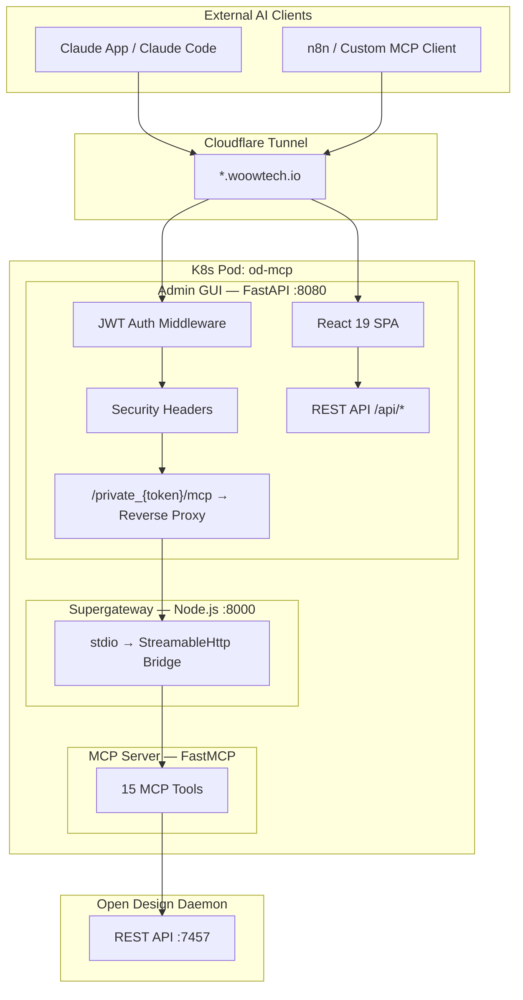

<p align="center">
  
</p>

<h1 align="center">Open Design MCP Server</h1>

<p align="center">
  <strong>Enterprise-grade MCP bridge for <a href="https://opendesign.dev">Open Design</a> — manage AI design agents via the Model Context Protocol.</strong>
</p>

<p align="center">
  
  
  
  
  
  
</p>

<p align="center">
  <a href="README_zh-TW.md">繁體中文文件</a>
</p>

---

## Overview

**Open Design MCP Server** exposes the [Open Design](https://opendesign.dev) daemon's REST API as **15 MCP tools** over the **StreamableHttp** transport, enabling any MCP-compatible AI client (Claude App, Claude Code, n8n, etc.) to create, iterate, and manage AI-generated design projects.

The package includes a full-featured **Admin GUI** (React 19 SPA) for monitoring, tool management, token rotation, and live log viewing — all secured with JWT authentication, CORS allowlists, and security headers.

## Why This Package?

| Challenge | Solution |
|---|---|
| Open Design daemon only has a REST API — no MCP support | FastMCP server translates 15 REST endpoints into MCP tools |
| MCP stdio transport isn't network-accessible | Supergateway bridges stdio → StreamableHttp over HTTP |
| No admin interface for managing MCP tools and tokens | React 19 SPA with Dashboard, Tool Manager, Token Manager |
| Security for exposed MCP endpoints | JWT auth, CORS allowlist, SSRF protection, security headers, encrypted proxy |
| Long-running AI agent operations (3-5 min) | SSE streaming parser with configurable timeouts (up to 300s) |
| Deployment complexity (3 components) | Single Docker image with multi-stage build, K8s-ready |

## Features

### Core Capabilities
- **15 MCP Tools** — System info, project CRUD, file access, AI chat (SSE streaming), content discovery
- **StreamableHttp Transport** — Network-accessible MCP via Supergateway (stdio → HTTP bridge)
- **SSE Response Parser** — Handles long-running AI agent operations with real-time text streaming
- **Configurable Timeouts** — 60s for reads, 300s for AI chat operations

### Admin GUI
- **Dashboard** — Real-time health monitoring (daemon, MCP server, proxy status)
- **Tool Manager** — Enable/disable individual MCP tools without restarting
- **Token Manager** — Generate, rotate, and manage MCP authentication tokens
- **Log Viewer** — Live-streaming server logs with severity filtering
- **Settings** — Connection configuration with SSRF-protected connectivity testing

### Security
- **JWT Authentication** — HS256 tokens with configurable expiry (default 24h)
- **CORS Allowlist** — Explicit origin allowlist (no wildcards)
- **Security Headers** — HSTS, X-Frame-Options: DENY, X-Content-Type-Options, Referrer-Policy
- **SSRF Protection** — Block metadata endpoints (169.254.169.254), loopback, link-local addresses
- **Request Size Limit** — 1 MB body limit to prevent abuse
- **Encrypted MCP Proxy** — Token-based URL path for MCP endpoint access
- **Secure Cookies** — HttpOnly, Secure, SameSite=Strict

## Architecture



### Three-Component Architecture

| Component | Technology | Port | Role |
|---|---|---|---|
| **MCP Server** | Python FastMCP | stdio | 15 MCP tools wrapping OD daemon REST API |
| **Supergateway** | Node.js | 8000 | Bridges MCP stdio → StreamableHttp transport |
| **Admin GUI** | FastAPI + React 19 | 8080 | Web management console + MCP reverse proxy |

### Data Flow

```
AI Client → Cloudflare Tunnel → Admin GUI (:8080)
                                    ├── /private_{token}/mcp → Supergateway (:8000) → MCP Server (stdio) → OD Daemon (:7457)
                                    └── /api/* → REST API (settings, tools, tokens, logs)
```

## MCP Tools (15)

### Category A: System Tools (4)

| Tool | Description | Parameters |
|---|---|---|
| `health` | Check OD daemon health status and version | — |
| `version` | Get detailed daemon version info | — |
| `list_agents` | List available AI agent CLIs (Claude, OpenCode, BYOK) | — |
| `list_connectors` | List external connectors (GitHub, etc.) | — |

### Category B: Project Tools (5)

| Tool | Description | Parameters |
|---|---|---|
| `list_projects` | List all design projects with status and metadata | — |
| `get_project` | Get detailed info about a specific project | `project_id` |
| `create_project` | Create a new project via AI agent (long-running, up to 5 min) | `prompt`, `agent_id` |
| `delete_project` | Permanently delete a project | `project_id` |
| `list_project_files` | List all files in a project directory | `project_id` |

### Category C: File Tools (2)

| Tool | Description | Parameters |
|---|---|---|
| `read_file` | Read raw content of a project file | `project_id`, `file_path` |
| `get_file_info` | Get file metadata (size, MIME type) | `project_id`, `file_path` |

### Category D: AI Chat Tools (2)

| Tool | Description | Parameters |
|---|---|---|
| `send_message` | Send follow-up message in a project conversation (long-running) | `project_id`, `prompt`, `agent_id` |
| `list_runs` | List all active and completed AI agent runs | — |

### Category E: Content Tools (2)

| Tool | Description | Parameters |
|---|---|---|
| `list_plugins` | List available plugins and templates | — |
| `list_skills` | List available design skills and triggers | — |

## Admin GUI

### Login

Secure JWT-based authentication with admin password.

<p align="center">
  
</p>

### Dashboard

Real-time health monitoring — OD Daemon status, MCP Server status, Proxy status, daemon version, and namespace info.

<p align="center">
  
</p>

### Tool Manager

Enable or disable individual MCP tools. View tool categories, parameters, and descriptions.

<p align="center">
  
</p>

### Token Manager

Generate and rotate MCP authentication tokens. View token history and connection URLs.

<p align="center">
  
</p>

### Log Viewer

Live-streaming server logs with auto-scroll and severity filtering.

<p align="center">
  
</p>

### Settings

Connection configuration, MCP server process management, and SSRF-protected connectivity testing.

<p align="center">
  
</p>

## Quick Start

### Docker

```bash
# Build
docker build -t od-mcp-server:latest .

# Run
docker run -d \
  -p 8080:8080 \
  -p 8000:8000 \
  -e OD_API_BASE=http://your-od-daemon:7457 \
  -e JWT_SECRET=your-secret-key \
  -v od-mcp-data:/data \
  od-mcp-server:latest
```

### Kubernetes (K3s)

```bash
# Apply manifests
kubectl apply -f k8s-manifests/

# Verify
kubectl get pods -n open-design
kubectl logs -n open-design deployment/od-mcp -c admin-gui
```

### MCP Client Configuration

Connect any MCP client using the StreamableHttp endpoint:

```json
{
  "mcpServers": {
    "open-design": {
      "url": "https://your-domain.com/private_{YOUR_TOKEN}/mcp",
      "transport": "streamable-http"
    }
  }
}
```

## Tech Stack

### Backend (Python)

| Package | Version | Purpose |
|---|---|---|
| FastAPI | 0.115+ | Admin GUI REST API framework |
| Uvicorn | 0.34+ | ASGI server |
| httpx | 0.28+ | HTTP client for OD daemon communication |
| Pydantic | 2.10+ | Data validation and serialization |
| PyJWT | 2.10+ | JWT authentication |
| SSE-Starlette | 2.2+ | Server-Sent Events support |
| mcp[server] | 1.1+ | MCP protocol SDK (FastMCP) |
| PyYAML | 6.0+ | Configuration file parsing |
| aiofiles | 24.1+ | Async file I/O |

### Frontend (JavaScript)

| Package | Version | Purpose |
|---|---|---|
| React | 19.0 | UI framework |
| React Router | 7.0 | Client-side routing |
| TanStack React Query | 5.60 | Server state management |
| Lucide React | 0.460 | Icon library |
| Tailwind CSS | 4.0 | Utility-first CSS framework |
| Vite | 6.0 | Build tool and dev server |

### Infrastructure

| Component | Purpose |
|---|---|
| Supergateway | stdio → StreamableHttp MCP transport bridge |
| Docker (multi-stage) | Node 22 (frontend build) → Python 3.12-slim (runtime) |
| K3s / Kubernetes | Container orchestration |
| Cloudflare Tunnel | Secure external access with TLS termination |

## Project Structure

```
.
├── od_mcp_server.py          # MCP server — 15 tools (FastMCP, stdio)
├── od_mcp_admin/             # Admin GUI app (FastAPI entry point)
│   └── routers/
│       └── config.py         # OD-specific connection config router
├── mcp_admin_core/           # Shared admin framework
│   ├── app.py                # FastAPI app factory + security middleware
│   ├── auth/
│   │   └── middleware.py     # JWT auth middleware + login router
│   ├── config.py             # JSON config store
│   ├── process.py            # MCP server process manager
│   ├── proxy.py              # MCP reverse proxy
│   └── routers/
│       └── settings.py       # Full config management API
├── frontend/                 # React 19 SPA (Vite + Tailwind CSS 4)
│   ├── src/
│   │   ├── pages/            # Dashboard, Tools, Tokens, Logs, Settings
│   │   └── components/       # Shared UI components
│   └── package.json
├── k8s-manifests/            # Kubernetes deployment manifests
├── Dockerfile                # Multi-stage build (Node 22 + Python 3.12)
├── entrypoint.sh             # Container startup script
└── pyproject.toml            # Python project configuration
```

## Security

- **Authentication**: JWT (HS256) with configurable expiry, secure cookie storage
- **Transport**: All traffic encrypted via Cloudflare Tunnel (TLS 1.3)
- **CORS**: Explicit origin allowlist — no wildcard `*`
- **Headers**: HSTS, X-Frame-Options: DENY, X-Content-Type-Options: nosniff, Referrer-Policy
- **SSRF Protection**: Blocks requests to cloud metadata endpoints, loopback, and link-local addresses
- **Request Limits**: 1 MB body size limit
- **Token Security**: MCP tokens masked in API responses, rotation with history tracking
- **API Surface**: Swagger/OpenAPI docs disabled in production

## License

MIT License. See [LICENSE](LICENSE) for details.

---

<p align="center">
  Built by <a href="https://github.com/WOOWTECH">WOOWTECH</a>
</p>
