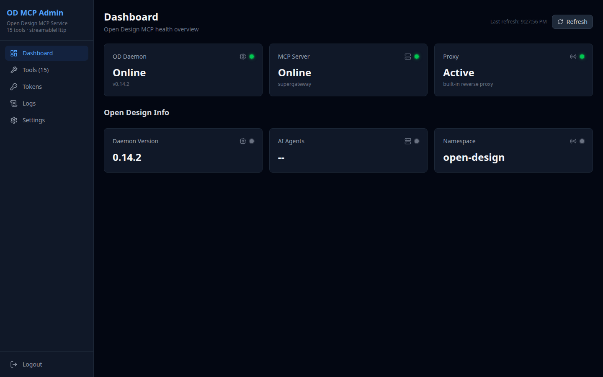
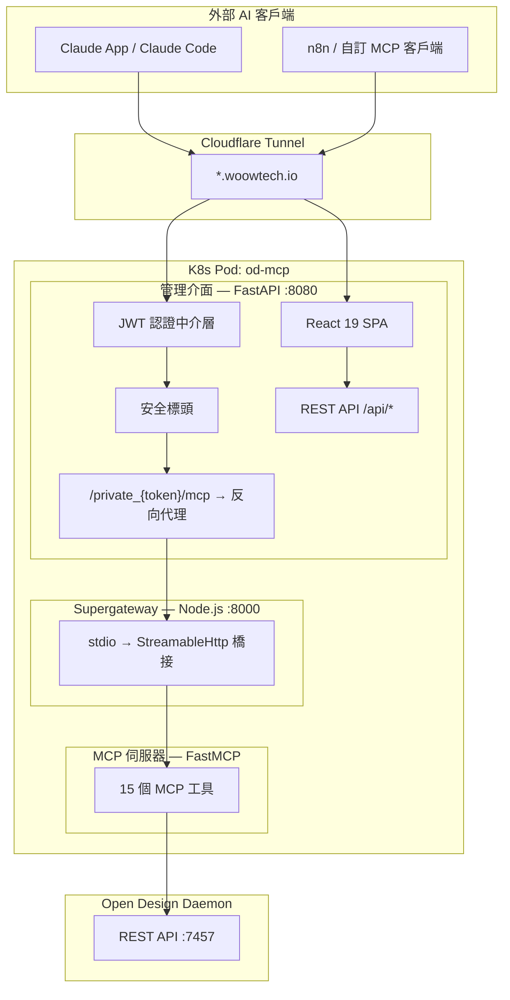
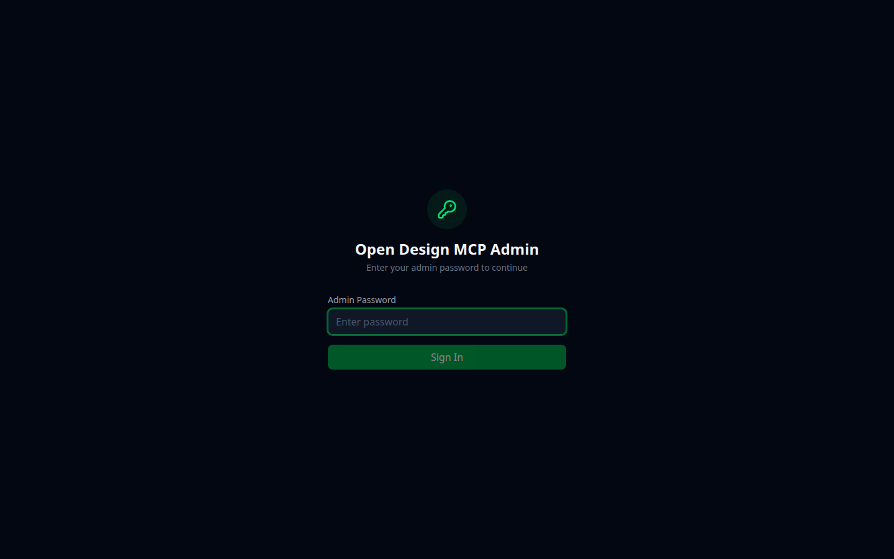
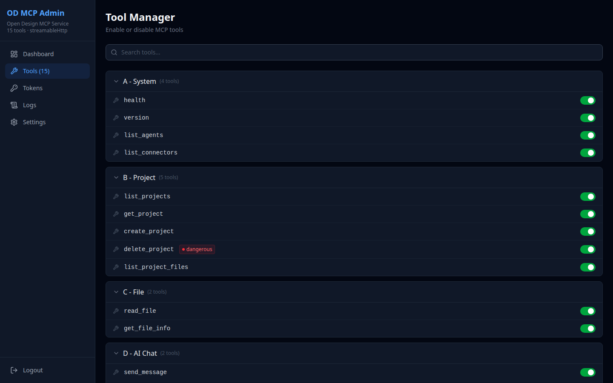
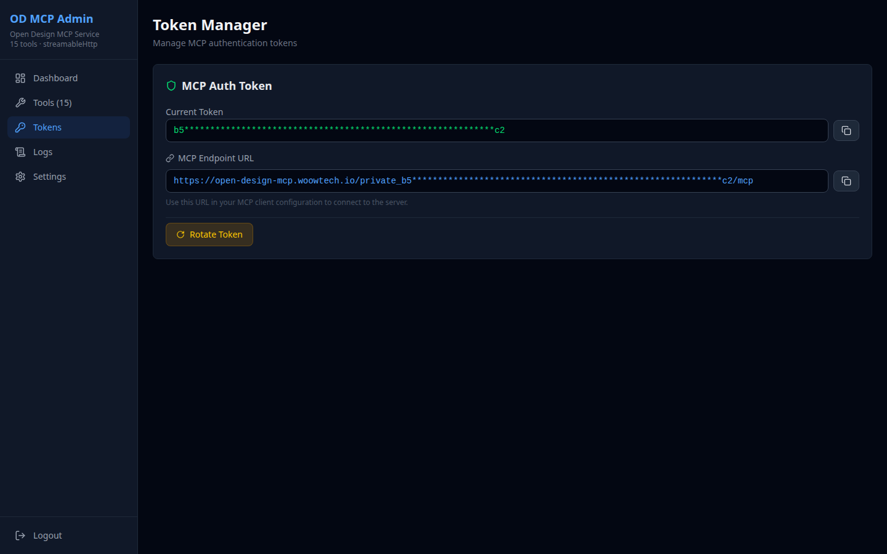
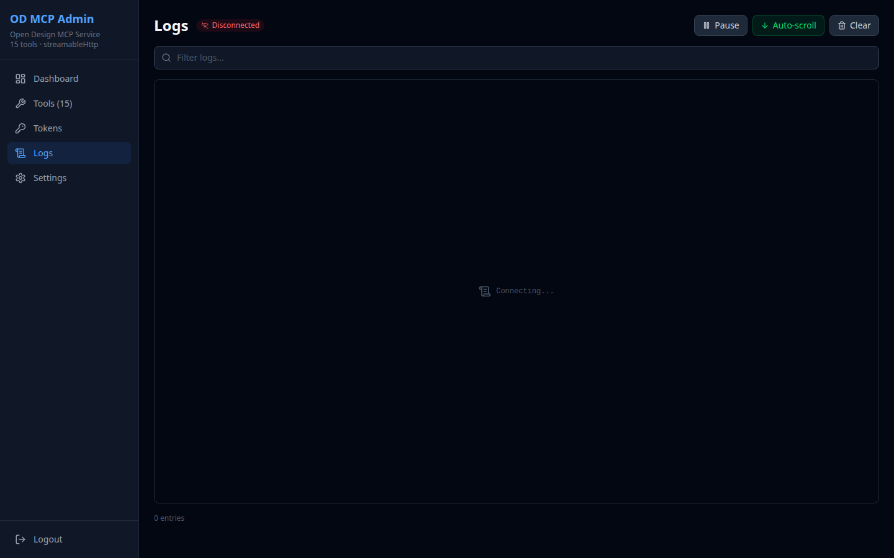
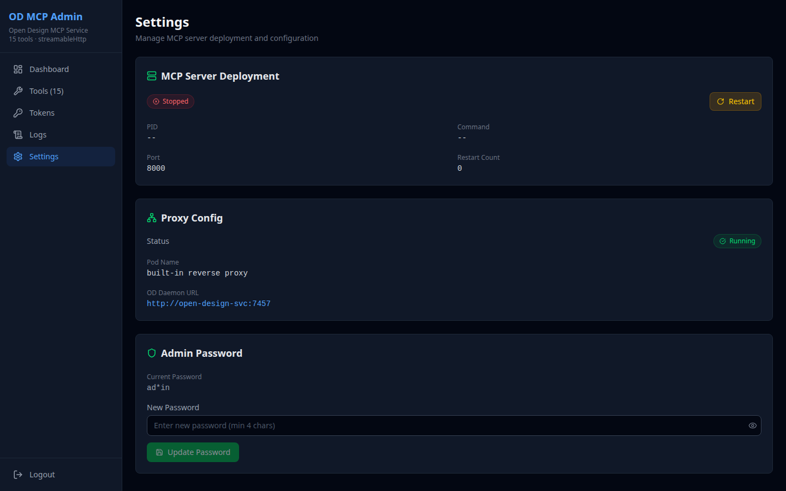

<p align="center">
  
</p>

<h1 align="center">Open Design MCP Server</h1>

<p align="center">
  <strong>企業級 MCP 橋接器 — 透過 Model Context Protocol 管理 <a href="https://opendesign.dev">Open Design</a> AI 設計代理。</strong>
</p>

<p align="center">
  
  
  
  
  
  
</p>

<p align="center">
  <a href="README.md">English Documentation</a>
</p>

---

## 概述

**Open Design MCP Server** 將 [Open Design](https://opendesign.dev) daemon 的 REST API 封裝為 **15 個 MCP 工具**，透過 **StreamableHttp** 傳輸協定，讓任何支援 MCP 的 AI 客戶端（Claude App、Claude Code、n8n 等）都能建立、迭代和管理 AI 生成的設計專案。

本套件包含完整的 **管理介面**（React 19 SPA），提供監控、工具管理、令牌輪換和即時日誌查看功能 — 全部透過 JWT 認證、CORS 白名單和安全標頭加以保護。

## 為什麼需要這個套件？

| 挑戰 | 解決方案 |
|---|---|
| Open Design daemon 僅有 REST API — 不支援 MCP | FastMCP 伺服器將 15 個 REST 端點轉換為 MCP 工具 |
| MCP stdio 傳輸協定無法透過網路存取 | Supergateway 橋接 stdio → StreamableHttp |
| 沒有管理 MCP 工具和令牌的介面 | React 19 SPA，含 Dashboard、工具管理、令牌管理 |
| 暴露的 MCP 端點需要安全防護 | JWT 認證、CORS 白名單、SSRF 防護、安全標頭、加密代理 |
| 長時間執行的 AI 代理操作（3-5 分鐘） | SSE 串流解析器，可配置超時時間（最長 300 秒） |
| 部署複雜度高（3 個元件） | 單一 Docker 映像檔，多階段建置，支援 K8s |

## 功能特色

### 核心功能
- **15 個 MCP 工具** — 系統資訊、專案 CRUD、檔案存取、AI 對話（SSE 串流）、內容探索
- **StreamableHttp 傳輸** — 透過 Supergateway 將 MCP 暴露至網路（stdio → HTTP 橋接）
- **SSE 回應解析器** — 處理長時間執行的 AI 代理操作，支援即時文字串流
- **可配置超時** — 讀取操作 60 秒，AI 對話操作 300 秒

### 管理介面
- **儀表板** — 即時健康監控（daemon、MCP 伺服器、代理狀態）
- **工具管理** — 無需重啟即可啟用/停用個別 MCP 工具
- **令牌管理** — 生成、輪換和管理 MCP 認證令牌
- **日誌查看** — 即時串流伺服器日誌，支援嚴重度過濾
- **設定** — 連線配置，含 SSRF 防護的連線測試

### 安全性
- **JWT 認證** — HS256 令牌，可配置過期時間（預設 24 小時）
- **CORS 白名單** — 明確的來源白名單（無萬用字元）
- **安全標頭** — HSTS、X-Frame-Options: DENY、X-Content-Type-Options、Referrer-Policy
- **SSRF 防護** — 阻擋雲端 metadata 端點（169.254.169.254）、迴路和鏈路本地位址
- **請求大小限制** — 1 MB 主體限制，防止濫用
- **加密 MCP 代理** — 基於令牌的 URL 路徑存取 MCP 端點
- **安全 Cookie** — HttpOnly、Secure、SameSite=Strict

## 架構



### 三元件架構

| 元件 | 技術 | 連接埠 | 角色 |
|---|---|---|---|
| **MCP 伺服器** | Python FastMCP | stdio | 15 個 MCP 工具，封裝 OD daemon REST API |
| **Supergateway** | Node.js | 8000 | 橋接 MCP stdio → StreamableHttp 傳輸 |
| **管理介面** | FastAPI + React 19 | 8080 | Web 管理主控台 + MCP 反向代理 |

### 資料流

```
AI 客戶端 → Cloudflare Tunnel → 管理介面 (:8080)
                                    ├── /private_{token}/mcp → Supergateway (:8000) → MCP 伺服器 (stdio) → OD Daemon (:7457)
                                    └── /api/* → REST API（設定、工具、令牌、日誌）
```

## MCP 工具 (15)

### 類別 A：系統工具 (4)

| 工具 | 說明 | 參數 |
|---|---|---|
| `health` | 檢查 OD daemon 健康狀態和版本 | — |
| `version` | 取得詳細的 daemon 版本資訊 | — |
| `list_agents` | 列出可用的 AI 代理 CLI（Claude、OpenCode、BYOK） | — |
| `list_connectors` | 列出外部連接器（GitHub 等） | — |

### 類別 B：專案工具 (5)

| 工具 | 說明 | 參數 |
|---|---|---|
| `list_projects` | 列出所有設計專案及其狀態和中繼資料 | — |
| `get_project` | 取得特定專案的詳細資訊 | `project_id` |
| `create_project` | 透過 AI 代理建立新專案（長時間執行，最多 5 分鐘） | `prompt`, `agent_id` |
| `delete_project` | 永久刪除專案 | `project_id` |
| `list_project_files` | 列出專案目錄中的所有檔案 | `project_id` |

### 類別 C：檔案工具 (2)

| 工具 | 說明 | 參數 |
|---|---|---|
| `read_file` | 讀取專案檔案的原始內容 | `project_id`, `file_path` |
| `get_file_info` | 取得檔案中繼資料（大小、MIME 類型） | `project_id`, `file_path` |

### 類別 D：AI 對話工具 (2)

| 工具 | 說明 | 參數 |
|---|---|---|
| `send_message` | 在專案對話中發送後續訊息（長時間執行） | `project_id`, `prompt`, `agent_id` |
| `list_runs` | 列出所有進行中和已完成的 AI 代理執行 | — |

### 類別 E：內容工具 (2)

| 工具 | 說明 | 參數 |
|---|---|---|
| `list_plugins` | 列出可用的外掛和範本 | — |
| `list_skills` | 列出可用的設計技能和觸發條件 | — |

## 管理介面

### 登入

安全的 JWT 認證，使用管理員密碼登入。

<p align="center">
  
</p>

### 儀表板

即時健康監控 — OD Daemon 狀態、MCP 伺服器狀態、代理狀態、daemon 版本和命名空間資訊。

<p align="center">
  
</p>

### 工具管理

啟用或停用個別 MCP 工具。查看工具類別、參數和說明。

<p align="center">
  
</p>

### 令牌管理

生成和輪換 MCP 認證令牌。查看令牌歷史記錄和連線 URL。

<p align="center">
  
</p>

### 日誌查看

即時串流伺服器日誌，支援自動捲動和嚴重度過濾。

<p align="center">
  
</p>

### 設定

連線配置、MCP 伺服器程序管理，以及含 SSRF 防護的連線測試。

<p align="center">
  
</p>

## 快速開始

### Docker

```bash
# 建置
docker build -t od-mcp-server:latest .

# 執行
docker run -d \
  -p 8080:8080 \
  -p 8000:8000 \
  -e OD_API_BASE=http://your-od-daemon:7457 \
  -e JWT_SECRET=your-secret-key \
  -v od-mcp-data:/data \
  od-mcp-server:latest
```

### Kubernetes (K3s) — Helm

Chart 放在 [`charts/opendesign-mcp/`](charts/opendesign-mcp/)，該目錄的 README
說明所有 values、驗證方式、解除安裝，以及如何接管目前已經在跑的那一份。這個
repo 沒有 `k8s-manifests/` 目錄 — 舊版 README 指向的那些 manifest 從來就不在
本 repo 裡。

```bash
# 1. 先準備憑證：預設 chart 只「引用」Secret，不會自己建立。
#    把範例複製到 repo 外面填好，再套用你的副本。
cp charts/opendesign-mcp/examples/secrets.example.yaml /secure/path/od-mcp-secrets.yaml
$EDITOR /secure/path/od-mcp-secrets.yaml
kubectl -n open-design apply -f /secure/path/od-mcp-secrets.yaml

# 2. 安裝（image 在節點上自行建置：podman build -t od-mcp:latest .）
helm -n open-design upgrade --install od-mcp ./charts/opendesign-mcp \
  -f deploy/local/od-mcp.yaml

# 驗證
kubectl -n open-design rollout status deploy/od-mcp
helm -n open-design test od-mcp --logs
kubectl logs -n open-design deployment/od-mcp -c od-mcp
```

### MCP 客戶端設定

使用 StreamableHttp 端點連接任何 MCP 客戶端：

```json
{
  "mcpServers": {
    "open-design": {
      "url": "https://your-domain.com/private_{YOUR_TOKEN}/mcp",
      "transport": "streamable-http"
    }
  }
}
```

## 技術堆疊

### 後端（Python）

| 套件 | 版本 | 用途 |
|---|---|---|
| FastAPI | 0.115+ | 管理介面 REST API 框架 |
| Uvicorn | 0.34+ | ASGI 伺服器 |
| httpx | 0.28+ | 與 OD daemon 通訊的 HTTP 客戶端 |
| Pydantic | 2.10+ | 資料驗證和序列化 |
| PyJWT | 2.10+ | JWT 認證 |
| SSE-Starlette | 2.2+ | Server-Sent Events 支援 |
| mcp[server] | 1.1+ | MCP 協定 SDK（FastMCP） |
| PyYAML | 6.0+ | 設定檔解析 |
| aiofiles | 24.1+ | 非同步檔案 I/O |

### 前端（JavaScript）

| 套件 | 版本 | 用途 |
|---|---|---|
| React | 19.0 | UI 框架 |
| React Router | 7.0 | 客戶端路由 |
| TanStack React Query | 5.60 | 伺服器狀態管理 |
| Lucide React | 0.460 | 圖示庫 |
| Tailwind CSS | 4.0 | 原子化 CSS 框架 |
| Vite | 6.0 | 建置工具和開發伺服器 |

### 基礎設施

| 元件 | 用途 |
|---|---|
| Supergateway | stdio → StreamableHttp MCP 傳輸橋接 |
| Docker（多階段） | Node 22（前端建置）→ Python 3.12-slim（執行環境） |
| K3s / Kubernetes | 容器編排 |
| Cloudflare Tunnel | 安全的外部存取，含 TLS 終端 |

## 專案結構

```
.
├── od_mcp_server.py          # MCP 伺服器 — 15 個工具（FastMCP, stdio）
├── od_mcp_admin/             # 管理介面應用程式（FastAPI 進入點）
│   └── routers/
│       └── config.py         # OD 專用連線設定路由
├── mcp_admin_core/           # 共用管理框架
│   ├── app.py                # FastAPI 應用程式工廠 + 安全中介層
│   ├── auth/
│   │   └── middleware.py     # JWT 認證中介層 + 登入路由
│   ├── config.py             # JSON 設定儲存
│   ├── process.py            # MCP 伺服器程序管理器
│   ├── proxy.py              # MCP 反向代理
│   └── routers/
│       └── settings.py       # 完整設定管理 API
├── frontend/                 # React 19 SPA（Vite + Tailwind CSS 4）
│   ├── src/
│   │   ├── pages/            # 儀表板、工具、令牌、日誌、設定
│   │   └── components/       # 共用 UI 元件
│   └── package.json
├── charts/opendesign-mcp/    # Helm chart（另有專屬 README）
├── deploy/local/od-mcp.yaml  # 線上 release 的 instance values（不含機密）
├── scripts/check-drift.sh    # chart 與叢集的漂移檢查
├── Dockerfile                # 多階段建置（Node 22 + Python 3.12）
├── entrypoint.sh             # 容器啟動腳本
└── pyproject.toml            # Python 專案配置
```

## 安全性

- **認證**：JWT（HS256），可配置過期時間，安全 cookie 儲存
- **傳輸**：所有流量透過 Cloudflare Tunnel 加密（TLS 1.3）
- **CORS**：明確的來源白名單 — 無萬用字元 `*`
- **標頭**：HSTS、X-Frame-Options: DENY、X-Content-Type-Options: nosniff、Referrer-Policy
- **SSRF 防護**：阻擋雲端 metadata 端點、迴路和鏈路本地位址
- **請求限制**：1 MB 主體大小限制
- **令牌安全**：MCP 令牌在 API 回應中遮蔽，支援輪換和歷史記錄追蹤
- **API 表面**：生產環境停用 Swagger/OpenAPI 文件

## 授權

MIT 授權。詳見 [LICENSE](LICENSE)。

---

<p align="center">
  由 <a href="https://github.com/WOOWTECH">WOOWTECH</a> 打造
</p>
